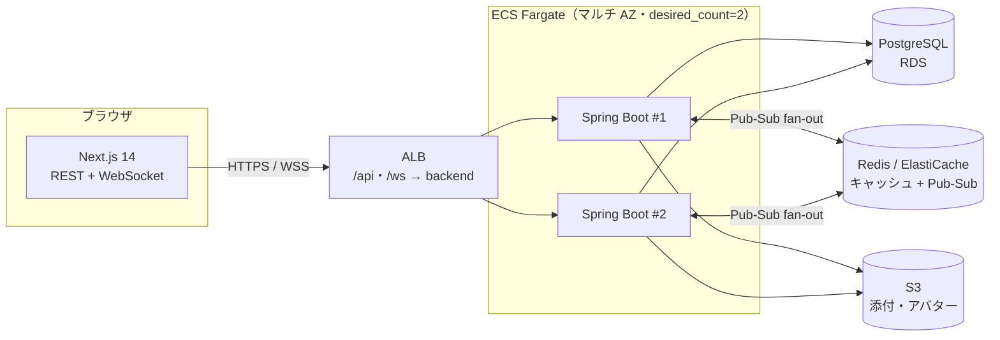

# RaiseChat

**WebSocket によるリアルタイム配信・Redis Pub-Sub での水平スケール・AWS 本番運用までを一気通貫で実装した、Slack 風チャット Web アプリケーション。**

要件定義 → 設計（画面 / DB / API / インフラ / リアルタイム）→ 実装 → 自動レビュー → AWS デプロイまでを、ドキュメント駆動で一貫して進めたフルスタック個人開発プロジェクト。

| | |
| --- | --- |
| **フロントエンド** | Next.js 14 / TypeScript / Tailwind CSS |
| **バックエンド** | Spring Boot 3.5 / Java 21 / Spring Security + JWT |
| **データ層** | PostgreSQL 17（Flyway）/ Redis 7（キャッシュ・Pub-Sub） |
| **リアルタイム** | WebSocket（STOMP over SockJS）+ Redis Pub-Sub によるマルチインスタンス配信 |
| **インフラ** | AWS ECS Fargate / RDS / ElastiCache / ALB / S3（Terraform + GitHub Actions CI/CD） |
| **規模** | 機能 17・REST 13 コントローラ＋WebSocket・DB 15 テーブル・テスト 230 ケース・Terraform 7 モジュール |

---

## 技術的ハイライト

このプロジェクトで重点的に作り込んだ、設計判断が問われた箇所。

### 1. 複数インスタンスでも全員に届くリアルタイム配信

WebSocket は接続したサーバー上のクライアントにしかイベントを直接届けられないため、バックエンドを冗長化（`desired_count = 2`）すると「別インスタンスに繋いだユーザーにメッセージが届かない」問題が起きる。これを **Redis Pub-Sub によるファンアウト**で解決した。メッセージ作成時に Redis チャネルへ publish し、全インスタンスが購読して自分に繋がっているクライアントへ STOMP で配信する。AWS 上で `desired_count = 2` の 2 セッション間でリアルタイム同期を実機検証済み。
→ 設計詳細: [docs/realtime-design.md](docs/realtime-design.md)

### 2. 認可を意識した WebSocket 購読制御

「誰がどの destination を購読できるか」を STOMP の SUBSCRIBE 時にチェックし、所属していないチャンネル / DM のイベントを購読できないようにした。REST だけでなくリアルタイム経路にも認可を貫通させている。

### 3. 添付付きメッセージ作成 API の設計

ファイル添付（F-10）では「先にメッセージを作ってから添付を後付けする」のではなく、**添付込みのメッセージ作成 API を新設**（multipart POST）。作成 → S3 アップロード → 添付込みの `MESSAGE_CREATED` を 1 回だけ配信する流れにし、リアルタイム配信が「本文だけ先に届いて添付が後から差し込まれる」不整合を避けた。本文なしのファイルのみ投稿にも、Flyway マイグレーション（V3）で本文長制約を緩和して対応。

### 4. 招待・キックのリアルタイム反映

メンバー招待 / キックをサーバー側イベント（`CHANNEL_ADDED` / `channelRemoved`）として発行し、対象ユーザーの画面にリロードなしでチャンネルの出現・消失を反映。2 アクターでの E2E で実機確認済み。

### 5. AWS 本番構成を Terraform でコード化

ネットワーク（VPC / マルチ AZ サブネット / SG）・ECS Fargate・RDS・ElastiCache・ALB・S3・CI/CD・監視・踏み台を **7 つの Terraform モジュール**に分割。GitHub Actions で `build → ECR push → ECS デプロイ` を自動化。実際に `apply` して受け入れ試験（認証 / 送受信 / WebSocket / S3 公開 URL の画像表示 / 2 セッションのリアルタイム同期）を通し、`destroy` で残存リソースゼロまで確認した。
→ 構成詳細: [docs/infrastructure.md](docs/infrastructure.md) / 運用手順: [infra/RUNBOOK.md](infra/RUNBOOK.md)

---

## アーキテクチャ概要



各インスタンスは自分に繋がっているクライアントにしか直接 WebSocket を送れないため、メッセージは Redis Pub-Sub を経由して全インスタンスへファンアウトし、どのインスタンスに接続していても同じイベントが届く。

---

## プロジェクト概要

業務利用を前提に、Slack の中核体験（チャンネル＋スレッド＋全文検索＋絵文字リアクション＋メンション）をミニマムに再現する。Bot 連携やボイスチャンネル等の周辺機能はスコープ外とする。

「Slack 風」と発注された際にお客様が期待しているもの、他のビジネスチャットツール（Microsoft Teams / Chatwork / LINE WORKS / Google Chat / Discord / Mattermost）との比較、機能スコープの判断根拠は [docs/why-slack.md](docs/why-slack.md) に整理している。

> 本リポジトリは RaiseTech AI エンジニアコース **上級編** の課題として制作したもの。上級編テーマである WebSocket リアルタイム通信 / Redis キャッシュ戦略 / 冗長化構成 / 自動デプロイ / Claude Code 自動コードレビューを、実装で身につけることを目的としている。

---

## 機能一覧（MVP）

詳細は [docs/functional-requirements.md](docs/functional-requirements.md) を参照。

| 機能 | 概要 |
| --- | --- |
| F-01 ユーザー認証 | ユーザー ID + パスワードで登録・ログイン・ログアウト・JWT 認証 |
| F-02 プロフィール管理 | アバター画像・表示名・ステータスメッセージの編集 |
| F-03 ワークスペース管理 | ワークスペース新規作成・参加・切り替え |
| F-04 チャンネル管理 | パブリック / プライベートチャンネル作成・参加・退出 |
| F-05 チャンネルメッセージ | チャンネル内テキスト投稿（WebSocket リアルタイム配信） |
| F-06 ダイレクトメッセージ | 1 対 1 の DM |
| F-07 メッセージ編集・削除 | 自分のメッセージの編集・削除 |
| F-08 スレッド | メッセージへの返信。独立スレッドビュー |
| F-09 マークダウン記法 | 太字・コード・リスト・引用などのレンダリング |
| F-10 ファイル添付 | 画像・動画ファイル添付（S3 想定） |
| F-11 絵文字リアクション | メッセージへの絵文字リアクション |
| F-12 メンション | `@user` でユーザーを呼び出し |
| F-13 メッセージ検索 | ワークスペース内のメッセージ全文検索 |
| F-14 通知 | 未読メッセージ数・メンション通知 |
| F-15 招待機能 | オーナーがワークスペース / チャンネルに招待 |
| F-16 管理者操作 | オーナーによるユーザーキック・チャンネル削除 |
| F-17 プレゼンス / タイピング | オンライン状態表示・入力中インジケータ（WebSocket） |

---

## 技術スタック

採用技術・バージョンの確定版は [docs/tech-stack.md](docs/tech-stack.md) を参照（実ファイル `build.gradle` / `package.json` / `docker-compose.yml` を正とする）。

| レイヤー | 主要技術 |
| --- | --- |
| フロントエンド | Next.js 14.2.35 + TypeScript 5 + Tailwind CSS 3.4 |
| バックエンド | Spring Boot 3.5.14 + Java 21 |
| リアルタイム通信 | WebSocket（STOMP over SockJS） |
| データベース | PostgreSQL 17 |
| キャッシュ / Pub-Sub | Redis 7 系 |
| 認証 | Spring Security + JWT（JJWT 0.12.6） |
| ファイルストレージ | AWS S3（ローカルは LocalStack） |
| インフラ | AWS（ECS Fargate + RDS + ElastiCache + ALB + S3）。詳細は [docs/infrastructure.md](docs/infrastructure.md) |

---

## ドキュメント

設計判断の根拠を残すことを重視し、実装前に各設計書を作成している。

| ドキュメント | 内容 |
| --- | --- |
| [docs/requirements.md](docs/requirements.md) | 要件定義書（ハブ）。機能要件・非機能要件・スコープ外 |
| [docs/functional-requirements.md](docs/functional-requirements.md) | 機能要件書。F-01〜F-17 の機能定義・バリデーション・ユースケース |
| [docs/why-slack.md](docs/why-slack.md) | 「Slack 風」発注意図の解釈と競合比較・スコープ判断の根拠 |
| [docs/screen-design.md](docs/screen-design.md) | 画面設計書。画面一覧・ワイヤーフレーム・画面遷移図 |
| [docs/database-design.md](docs/database-design.md) | データベース設計書。15 テーブル定義・Flyway 運用ルール・docker-compose 構成方針 |
| [docs/api-design.md](docs/api-design.md) | API 設計書。REST エンドポイント・リクエスト / レスポンス仕様 |
| [docs/tech-stack.md](docs/tech-stack.md) | 技術スタック詳細。採用技術・バージョン一覧 |
| [docs/infrastructure.md](docs/infrastructure.md) | インフラ構成。AWS 構成図・ネットワーク・冗長化・CI/CD・Ansible |
| [docs/realtime-design.md](docs/realtime-design.md) | WebSocket / STOMP / Redis Pub-Sub 設計 |
| [docs/cache-strategy.md](docs/cache-strategy.md) | Redis キャッシュ戦略・TTL 設計 |
| [infra/RUNBOOK.md](infra/RUNBOOK.md) | AWS デプロイ / 受け入れ試験 / 撤去の運用手順 |
| [CLAUDE.md](CLAUDE.md) | Claude Code 利用時のルール（命名規則・GitHub フロー・ポート） |

---

## 開発フェーズ（このリポジトリの進め方）

本プロジェクトは以下の順で進める。Claude Code 自動レビューは **実装が一通り揃った後半（④）** で導入する。要件定義段階や設計段階で先に走らせても、まだコード差分が少なくレビューとして意味のある出力が得られないため。

| フェーズ | 内容 | 状態 |
| --- | --- | --- |
| ① 要件定義 | `why-slack.md` / `requirements.md` / `functional-requirements.md` を作成 | ✅ 完了 |
| ② 設計 | 画面・DB・API・技術スタック・インフラ・リアルタイム / キャッシュ設計を確定 | ✅ 完了 |
| ③ 実装 | バックエンド機能 → フロントエンド → 結合 | ✅ MVP（F-01〜F-17）完了・フロント結合済 |
| ④ 自動レビュー導入 | `.github/workflows/claude-code-review.yml` を導入。トークン消費を抑えるため `review` ラベル付与時に手動起動 | ✅ 導入済 |
| ⑤ デプロイ・運用 | AWS への自動デプロイ（GitHub Actions → ECR → ECS）、Ansible、監視 | ✅ Terraform / デプロイ / 受け入れ試験 / 撤去まで実機確認済 |

---

## ローカル開発セットアップ

### 前提

- Docker / Docker Compose v2
- Java 21（`./gradlew` 経由なので JDK のインストールだけあれば OK）
- Node.js（フロントエンドを動かす場合）

### ポート割当

| サーバー | ポート |
| --- | --- |
| フロントエンド（Next.js） | 3000 |
| バックエンド（Spring Boot） | 8080 |
| データベース（PostgreSQL） | 5432 |
| キャッシュ / Pub-Sub（Redis） | 6379 |

ポート競合時は **必ず競合プロセスを停止** して指定ポートで起動する（別ポートに逃げない）。`lsof -ti:<ポート> | xargs kill` で停止できる。

### 起動手順

```bash
# 1. 環境変数ファイルを用意（.env はリポジトリに含めない）
cp .env.example .env

# 2. PostgreSQL 17 / Redis 7 を起動
docker compose up -d
docker compose ps   # 両サービスが healthy になるまで数秒

# 3. バックエンド起動（Flyway が初期スキーマを自動マイグレーション）
cd backend
./gradlew bootRun
# → "Started BackendApplication in X.XXX seconds" が出れば成功

# 4. フロントエンド起動（別ターミナル）
cd frontend
npm install
npm run dev
```

### スキーマ確認

`./gradlew bootRun` の起動ログに以下が出ていれば Flyway が成功している:

```text
Successfully applied 3 migrations to schema "public", now at version v3
```

実テーブルの確認:

```bash
docker compose exec postgres psql -U raisechat -d raisechat -c "\dt"
# → 15 テーブル + flyway_schema_history = 16 行
```

### 停止

```bash
docker compose down       # コンテナ停止、ボリュームは残す
docker compose down -v    # ボリュームごと削除（DB を初期化したい時）
```

### マイグレーション運用

- マイグレーションファイルは `backend/src/main/resources/db/migration/V{番号}__{説明}.sql`
- **マージ済みの V ファイルは編集禁止**（Flyway のチェックサムが変わって起動失敗する）
- 修正は新しい V ファイルを作る
- ローカルで修復したい時は `docker compose down -v` で DB ボリュームごと作り直す
