# データベース設計書 — RaiseChat

関連: [要件定義書](requirements.md) / [機能要件書](functional-requirements.md) / [「Slack 風」の捉え方](why-slack.md)

---

## 0. はじめに

本書は RaiseChat の **論理スキーマ・物理スキーマ・インデックス・マイグレーション運用・初期化** を定義する。F-01〜F-16 の機能要件すべてを支えるデータベース設計を確定させ、次タスク（docker-compose セットアップと Spring Boot 初期化）以降の実装の基盤とする。

### 0.1 本書のスコープ

- ✅ PostgreSQL 17 を前提とした論理・物理スキーマ
- ✅ ER 図、テーブル定義、インデックス戦略
- ✅ Flyway によるマイグレーション運用ルール
- ✅ Redis キャッシュ層との責務分割の境界線（詳細は別書）
- ✅ 開発用シードデータの方針
- ✅ docker-compose による DB 起動構成の概要

### 0.2 本書のスコープ外（別ドキュメント）

| トピック | 担当ドキュメント |
| --- | --- |
| Redis キャッシュキー設計・TTL・無効化戦略 | [docs/cache-strategy.md](cache-strategy.md) |
| WebSocket / STOMP / Redis Pub-Sub 設計 | [docs/realtime-design.md](realtime-design.md) |
| API エンドポイント詳細・スキーマ | [docs/api-design.md](api-design.md) |
| 画面遷移・ワイヤーフレーム | [docs/screen-design.md](screen-design.md) |
| AWS 構成図 | [docs/infrastructure.md](infrastructure.md) |

---

## 1. 設計方針

以後のテーブル定義・インデックス選定の判断基準となる原則を宣言する。

| # | 原則 | 補足 |
| --- | --- | --- |
| 1 | **MVP 重視・素直に表現** | Slack 体験の中核（チャンネル / スレッド / 検索 / リアクション / メンション）を最小構成で表現する。早すぎる最適化はしない |
| 2 | **論理削除を基本とする** | 全テーブル共通で `deleted_at TIMESTAMPTZ NULL` を持ち、`WHERE deleted_at IS NULL` を全クエリの基本条件とする |
| 3 | **タイムスタンプは UTC `TIMESTAMPTZ` 統一** | 表示時にクライアントで JST 変換。`created_at` は `DEFAULT now()`、`updated_at` は PostgreSQL トリガー関数で自動更新 |
| 4 | **主キーは BIGINT 連番** | `BIGSERIAL` または `GENERATED ALWAYS AS IDENTITY`。インデックスサイズが小さくクエリが速い。公開 API で ID 推測を避けたい箇所のみ別途ランダム文字列（招待トークン等） |
| 5 | **DB をソース・オブ・トゥルース** | Redis は派生キャッシュ。再起動・障害時は DB から再構築可能 |
| 6 | **整合性は DB 制約で守る** | 外部キー・UNIQUE・CHECK を積極活用。アプリ層の暗黙ルールに依存しない |
| 7 | **ENUM は VARCHAR + CHECK で表現** | PostgreSQL ENUM 型は値の追加が `ALTER TYPE` 必須で硬い。マイグレーション柔軟性を優先 |
| 8 | **スキーマ変更は必ず Flyway 経由** | 手動 ALTER 禁止。マージ済み `V*` ファイルは編集禁止（修正は新規 V ファイル） |
| 9 | **非正規化カウンタは MVP では持たない** | スレッド数・最終メッセージ時刻等は都度 COUNT/SELECT。性能課題が顕在化してから追加する |

---

## 2. ER 図

GitHub の Markdown プレビューでそのままレンダリングされる Mermaid `erDiagram` で表現する。

```mermaid
erDiagram
    users ||--o{ refresh_tokens : "issues"
    users ||--o{ workspace_members : "joins"
    users ||--o{ channel_members : "joins"
    users ||--o{ dm_members : "joins"
    users ||--o{ messages : "authors"
    users ||--o{ reactions : "reacts"
    users ||--o{ mentions : "is_mentioned"
    users ||--o{ read_states : "tracks"
    users ||--o{ workspace_invites : "issues_invite"
    users ||--o{ channel_invites : "issues_invite"

    workspaces ||--o{ workspace_members : "has"
    workspaces ||--o{ channels : "has"
    workspaces ||--o{ dm_rooms : "has"
    workspaces ||--o{ workspace_invites : "has"

    channels ||--o{ channel_members : "has"
    channels ||--o{ channel_invites : "has"
    channels ||--o{ messages : "contains"
    channels ||--o{ read_states : "tracked_by"

    dm_rooms ||--o{ dm_members : "has"
    dm_rooms ||--o{ messages : "contains"
    dm_rooms ||--o{ read_states : "tracked_by"

    messages ||--o{ messages : "thread_replies"
    messages ||--o{ attachments : "has"
    messages ||--o{ reactions : "receives"
    messages ||--o{ mentions : "triggers"

    users {
        bigint id PK
        varchar user_id "UNIQUE 3-32"
        varchar display_name "1-32"
        varchar password_hash "Bcrypt"
        varchar avatar_url "nullable"
        varchar status_message "0-100"
        timestamptz created_at
        timestamptz updated_at
        timestamptz deleted_at "nullable"
    }

    workspaces {
        bigint id PK
        varchar name "1-64"
        varchar description "0-255"
        bigint owner_user_id FK
        timestamptz created_at
        timestamptz updated_at
        timestamptz deleted_at "nullable"
    }

    workspace_members {
        bigint id PK
        bigint workspace_id FK
        bigint user_id FK
        varchar role "OWNER|MEMBER"
        timestamptz joined_at
        timestamptz left_at "nullable"
    }

    channels {
        bigint id PK
        bigint workspace_id FK
        varchar name "1-80"
        varchar description "0-255"
        varchar type "PUBLIC|PRIVATE"
        bigint created_by_user_id FK
        timestamptz created_at
        timestamptz updated_at
        timestamptz deleted_at "nullable"
    }

    channel_members {
        bigint id PK
        bigint channel_id FK
        bigint user_id FK
        timestamptz joined_at
        timestamptz left_at "nullable"
    }

    dm_rooms {
        bigint id PK
        bigint workspace_id FK
        bigint user_a_id FK "user_a_id < user_b_id"
        bigint user_b_id FK
        timestamptz created_at
        timestamptz deleted_at "nullable"
    }

    dm_members {
        bigint id PK
        bigint dm_room_id FK
        bigint user_id FK
        timestamptz created_at
    }

    messages {
        bigint id PK
        bigint workspace_id FK "denormalized"
        bigint channel_id FK "XOR with dm_room_id"
        bigint dm_room_id FK "XOR with channel_id"
        bigint parent_message_id FK "self-ref, nullable"
        bigint author_user_id FK
        text body "0-4000"
        tsvector body_tsv "GENERATED"
        timestamptz edited_at "nullable"
        timestamptz created_at
        timestamptz updated_at
        timestamptz deleted_at "nullable"
    }

    attachments {
        bigint id PK
        bigint message_id FK
        bigint uploader_user_id FK
        varchar s3_bucket
        varchar s3_key
        varchar mime_type
        bigint size_bytes
        varchar original_filename
        int width "nullable"
        int height "nullable"
        int duration_sec "nullable"
        timestamptz created_at
        timestamptz deleted_at "nullable"
    }

    reactions {
        bigint id PK
        bigint message_id FK
        bigint user_id FK
        varchar emoji
        timestamptz created_at
    }

    mentions {
        bigint id PK
        bigint message_id FK
        bigint mentioned_user_id FK
        timestamptz created_at
    }

    read_states {
        bigint id PK
        bigint user_id FK
        bigint channel_id FK "XOR with dm_room_id"
        bigint dm_room_id FK "XOR with channel_id"
        bigint last_read_message_id FK
        timestamptz last_read_at
        timestamptz updated_at
    }

    workspace_invites {
        bigint id PK
        bigint workspace_id FK
        bigint invited_by_user_id FK
        varchar token_hash "UNIQUE"
        timestamptz expires_at
        int max_uses "nullable"
        int used_count "default 0"
        timestamptz created_at
        timestamptz revoked_at "nullable"
    }

    channel_invites {
        bigint id PK
        bigint channel_id FK
        bigint invited_by_user_id FK
        varchar token_hash "UNIQUE"
        timestamptz expires_at
        int max_uses "nullable"
        int used_count "default 0"
        timestamptz created_at
        timestamptz revoked_at "nullable"
    }

    refresh_tokens {
        bigint id PK
        bigint user_id FK
        varchar token_hash "UNIQUE"
        timestamptz issued_at
        timestamptz expires_at
        timestamptz revoked_at "nullable"
    }
```



### 2.1 リレーション概要

- `users` ⇔ `workspaces` は `workspace_members` を介した多対多
- `channels` と `dm_rooms` は **概念的に別物**だが、メッセージ本体は `messages` テーブルに統合（`channel_id` か `dm_room_id` を排他で持つ）
- スレッド返信は `messages.parent_message_id` の自己参照で表現
- 未読カウントの実体は Redis、`read_states` は再構築用の永続ソース

---

## 3. テーブル定義

各テーブルについて、カラム・型・制約・関連 F-XX を示す。`CREATE TABLE` 文の最終形は Flyway マイグレーション `V1__init_schema.sql` で確定する。

### 3.1 `users` — ユーザー（F-01, F-02）

| カラム | 型 | NULL | 制約 / 補足 |
| --- | --- | --- | --- |
| `id` | `BIGINT` | NOT NULL | PK, `GENERATED ALWAYS AS IDENTITY` |
| `user_id` | `VARCHAR(32)` | NOT NULL | UNIQUE, `CHECK (user_id ~ '^[A-Za-z0-9_-]{3,32}$')` (F-01) |
| `display_name` | `VARCHAR(32)` | NOT NULL | `CHECK (char_length(display_name) BETWEEN 1 AND 32)` (F-01) |
| `password_hash` | `VARCHAR(72)` | NOT NULL | Bcrypt ハッシュ |
| `avatar_url` | `VARCHAR(512)` | NULL | S3 上の URL（F-02） |
| `status_message` | `VARCHAR(100)` | NOT NULL DEFAULT `''` | `CHECK (char_length(status_message) <= 100)` (F-02) |
| `created_at` | `TIMESTAMPTZ` | NOT NULL DEFAULT `now()` | |
| `updated_at` | `TIMESTAMPTZ` | NOT NULL DEFAULT `now()` | トリガーで自動更新 |
| `deleted_at` | `TIMESTAMPTZ` | NULL | 論理削除 |

**インデックス**:
- `UNIQUE (user_id)`
- `UNIQUE (LOWER(user_id))` — 大文字小文字を区別しない重複チェック用（推奨）

**備考**: メールアドレスはメール認証を実装しないため（F-01）スコープ外。将来の通知拡張で必要になったら追加。

---

### 3.2 `refresh_tokens` — JWT リフレッシュトークン（F-01）

| カラム | 型 | NULL | 制約 / 補足 |
| --- | --- | --- | --- |
| `id` | `BIGINT` | NOT NULL | PK, IDENTITY |
| `user_id` | `BIGINT` | NOT NULL | FK → `users.id` |
| `token_hash` | `VARCHAR(64)` | NOT NULL | UNIQUE, SHA-256 ハッシュ。平文トークンは保存しない |
| `issued_at` | `TIMESTAMPTZ` | NOT NULL DEFAULT `now()` | |
| `expires_at` | `TIMESTAMPTZ` | NOT NULL | |
| `revoked_at` | `TIMESTAMPTZ` | NULL | ログアウト・パスワード変更時にセット |

**インデックス**:
- `UNIQUE (token_hash)`
- `(user_id, expires_at)` — 失効済みクリーンアップ用

---

### 3.3 `workspaces` — ワークスペース（F-03, F-16）

| カラム | 型 | NULL | 制約 / 補足 |
| --- | --- | --- | --- |
| `id` | `BIGINT` | NOT NULL | PK, IDENTITY |
| `name` | `VARCHAR(64)` | NOT NULL | `CHECK (char_length(name) BETWEEN 1 AND 64)` (F-03) |
| `description` | `VARCHAR(255)` | NOT NULL DEFAULT `''` | (F-03) |
| `owner_user_id` | `BIGINT` | NOT NULL | FK → `users.id` |
| `created_at` | `TIMESTAMPTZ` | NOT NULL DEFAULT `now()` | |
| `updated_at` | `TIMESTAMPTZ` | NOT NULL DEFAULT `now()` | トリガー自動更新 |
| `deleted_at` | `TIMESTAMPTZ` | NULL | 論理削除（F-16） |

**備考**: 削除は論理削除（F-16）。配下のチャンネル・メッセージは外部キー CASCADE せず、論理削除を独立に運用する（孤児クエリは `WHERE deleted_at IS NULL` で素直に除外できるため）。

---

### 3.4 `workspace_members` — ワークスペース所属（F-03, F-16）

| カラム | 型 | NULL | 制約 / 補足 |
| --- | --- | --- | --- |
| `id` | `BIGINT` | NOT NULL | PK, IDENTITY |
| `workspace_id` | `BIGINT` | NOT NULL | FK → `workspaces.id` |
| `user_id` | `BIGINT` | NOT NULL | FK → `users.id` |
| `role` | `VARCHAR(16)` | NOT NULL | `CHECK (role IN ('OWNER','MEMBER'))` |
| `joined_at` | `TIMESTAMPTZ` | NOT NULL DEFAULT `now()` | |
| `left_at` | `TIMESTAMPTZ` | NULL | NULL=在籍中、値あり=退出 or キック済み（F-16） |

**インデックス**:
- `UNIQUE (workspace_id, user_id)`
- `(user_id, left_at)` — 自分が所属中のワークスペース取得用

---

### 3.5 `workspace_invites` — ワークスペース招待（F-15）

| カラム | 型 | NULL | 制約 / 補足 |
| --- | --- | --- | --- |
| `id` | `BIGINT` | NOT NULL | PK, IDENTITY |
| `workspace_id` | `BIGINT` | NOT NULL | FK → `workspaces.id` |
| `invited_by_user_id` | `BIGINT` | NOT NULL | FK → `users.id` |
| `token_hash` | `VARCHAR(64)` | NOT NULL | UNIQUE, SHA-256 ハッシュ |
| `expires_at` | `TIMESTAMPTZ` | NOT NULL | 期限付き（F-15） |
| `max_uses` | `INT` | NULL | NULL=無制限、`1`=ワンタイム（F-15） |
| `used_count` | `INT` | NOT NULL DEFAULT 0 | |
| `created_at` | `TIMESTAMPTZ` | NOT NULL DEFAULT `now()` | |
| `revoked_at` | `TIMESTAMPTZ` | NULL | |

**インデックス**:
- `UNIQUE (token_hash)`
- `(workspace_id, expires_at)`

**備考**: 平文トークンは生成時のみクライアントに返し、DB には `token_hash` のみ保存する。

---

### 3.6 `channels` — チャンネル（F-04, F-16）

| カラム | 型 | NULL | 制約 / 補足 |
| --- | --- | --- | --- |
| `id` | `BIGINT` | NOT NULL | PK, IDENTITY |
| `workspace_id` | `BIGINT` | NOT NULL | FK → `workspaces.id` |
| `name` | `VARCHAR(80)` | NOT NULL | `CHECK (char_length(name) BETWEEN 1 AND 80)` (F-04) |
| `description` | `VARCHAR(255)` | NOT NULL DEFAULT `''` | (F-04) |
| `type` | `VARCHAR(16)` | NOT NULL | `CHECK (type IN ('PUBLIC','PRIVATE'))` (F-04) |
| `created_by_user_id` | `BIGINT` | NOT NULL | FK → `users.id` |
| `created_at` | `TIMESTAMPTZ` | NOT NULL DEFAULT `now()` | |
| `updated_at` | `TIMESTAMPTZ` | NOT NULL DEFAULT `now()` | トリガー自動更新 |
| `deleted_at` | `TIMESTAMPTZ` | NULL | (F-16) |

**インデックス**:
- `UNIQUE (workspace_id, LOWER(name)) WHERE deleted_at IS NULL` — Slack 同様、チャンネル名は小文字統一で一意
- `(workspace_id) WHERE deleted_at IS NULL` — チャンネル一覧取得

---

### 3.7 `channel_members` — チャンネル所属（F-04, F-15）

| カラム | 型 | NULL | 制約 / 補足 |
| --- | --- | --- | --- |
| `id` | `BIGINT` | NOT NULL | PK, IDENTITY |
| `channel_id` | `BIGINT` | NOT NULL | FK → `channels.id` |
| `user_id` | `BIGINT` | NOT NULL | FK → `users.id` |
| `joined_at` | `TIMESTAMPTZ` | NOT NULL DEFAULT `now()` | |
| `left_at` | `TIMESTAMPTZ` | NULL | NULL=参加中、値あり=退出済み |

**インデックス**:
- `UNIQUE (channel_id, user_id)`
- `(user_id, left_at)` — 自分が参加中のチャンネル取得

**備考**: 招待中（未承諾）状態を表現する別テーブルは MVP では作らない。招待＝即メンバー追加とする（F-15）。

---

### 3.8 `dm_rooms` — DM ルーム（F-06）

| カラム | 型 | NULL | 制約 / 補足 |
| --- | --- | --- | --- |
| `id` | `BIGINT` | NOT NULL | PK, IDENTITY |
| `workspace_id` | `BIGINT` | NOT NULL | FK → `workspaces.id` |
| `user_a_id` | `BIGINT` | NOT NULL | FK → `users.id`, **常に `user_a_id < user_b_id`** を保証 |
| `user_b_id` | `BIGINT` | NOT NULL | FK → `users.id` |
| `created_at` | `TIMESTAMPTZ` | NOT NULL DEFAULT `now()` | |
| `deleted_at` | `TIMESTAMPTZ` | NULL | |

**制約**:
- `CHECK (user_a_id < user_b_id)` — 順序固定で重複防止を可能に
- `UNIQUE (workspace_id, user_a_id, user_b_id)` — 同一 WS 内・同じ 2 人組の DM 重複作成を DB レベルで阻止（F-06）

**備考**: DM 作成 API ではアプリ層で `(min, max)` の順に並べ替えて INSERT する。

---

### 3.9 `dm_members` — DM 参加者（F-06）

| カラム | 型 | NULL | 制約 / 補足 |
| --- | --- | --- | --- |
| `id` | `BIGINT` | NOT NULL | PK, IDENTITY |
| `dm_room_id` | `BIGINT` | NOT NULL | FK → `dm_rooms.id` |
| `user_id` | `BIGINT` | NOT NULL | FK → `users.id` |
| `created_at` | `TIMESTAMPTZ` | NOT NULL DEFAULT `now()` | |

**インデックス**:
- `UNIQUE (dm_room_id, user_id)`
- `(user_id)` — 自分が参加している DM 一覧取得

**備考**: `dm_rooms.user_a_id` / `user_b_id` と冗長だが、`channel_members` と同じインタフェースで「自分が所属する room」をクエリできるようにするために独立テーブルを持つ。

---

### 3.10 `messages` — メッセージ（F-05〜F-09, F-13）

本ドキュメントの中核テーブル。チャンネルメッセージ・DM メッセージ・スレッド返信を統一して扱う。

| カラム | 型 | NULL | 制約 / 補足 |
| --- | --- | --- | --- |
| `id` | `BIGINT` | NOT NULL | PK, IDENTITY |
| `workspace_id` | `BIGINT` | NOT NULL | FK → `workspaces.id`、検索高速化のため冗長保持 |
| `channel_id` | `BIGINT` | NULL | FK → `channels.id`（XOR） |
| `dm_room_id` | `BIGINT` | NULL | FK → `dm_rooms.id`（XOR） |
| `parent_message_id` | `BIGINT` | NULL | FK → `messages.id`（自己参照、スレッド返信） |
| `author_user_id` | `BIGINT` | NOT NULL | FK → `users.id`。投稿者退会後も author_user_id は CASCADE しない |
| `body` | `TEXT` | NOT NULL | `CHECK (char_length(body) <= 4000)` (F-05)。下限は `V3` で撤廃（file-only 添付のため空文字 `''` を許容） |
| `body_tsv` | `tsvector` | NOT NULL | `GENERATED ALWAYS AS (to_tsvector('simple', body)) STORED` (F-13) |
| `edited_at` | `TIMESTAMPTZ` | NULL | F-07「(編集済み)」マーク用 |
| `created_at` | `TIMESTAMPTZ` | NOT NULL DEFAULT `now()` | |
| `updated_at` | `TIMESTAMPTZ` | NOT NULL DEFAULT `now()` | トリガー自動更新 |
| `deleted_at` | `TIMESTAMPTZ` | NULL | (F-07) |

**制約**:
- `CHECK ((channel_id IS NOT NULL) <> (dm_room_id IS NOT NULL))` — どちらか一方のみ
- スレッド返信の場合、`parent_message_id` の指すメッセージは「`parent_message_id IS NULL` のトップレベルメッセージ」であること（アプリ層で検証）

**備考**:
- マークダウン（F-09）の本文は加工せず生のまま `body` に保存。レンダリングはフロントで `react-markdown` + `rehype-sanitize`。
- F-07 の編集時、`body` を更新し `edited_at = now()` をセット。`body_tsv` は GENERATED COLUMN のため自動で再計算される。
- 日本語形態素解析（`pgroonga` 等）は後続課題（拡張余地）。MVP は `simple` 辞書で部分一致と前方一致を行う。
- **F-10 file-only 添付**（`V3`）: 本文長の下限 `1` を撤廃し、添付のみ（本文空文字）のメッセージを許可した。「本文か添付のどちらかは必須」は DB の CHECK では本文と添付（別テーブル）を相関できないため、アプリ層（`MessageController`）で担保する。

---

### 3.11 `attachments` — メッセージ添付ファイル（F-10）

| カラム | 型 | NULL | 制約 / 補足 |
| --- | --- | --- | --- |
| `id` | `BIGINT` | NOT NULL | PK, IDENTITY |
| `message_id` | `BIGINT` | NOT NULL | FK → `messages.id` |
| `uploader_user_id` | `BIGINT` | NOT NULL | FK → `users.id` |
| `s3_bucket` | `VARCHAR(64)` | NOT NULL | |
| `s3_key` | `VARCHAR(512)` | NOT NULL | |
| `mime_type` | `VARCHAR(64)` | NOT NULL | `CHECK (mime_type IN ('image/jpeg','image/png','image/gif','image/webp','video/mp4'))` (F-10) |
| `size_bytes` | `BIGINT` | NOT NULL | `CHECK (size_bytes <= 10485760)` 10MB 上限 (F-10) |
| `original_filename` | `VARCHAR(255)` | NOT NULL | |
| `width` | `INT` | NULL | 画像用 |
| `height` | `INT` | NULL | 画像用 |
| `duration_sec` | `INT` | NULL | 動画用 |
| `created_at` | `TIMESTAMPTZ` | NOT NULL DEFAULT `now()` | |
| `deleted_at` | `TIMESTAMPTZ` | NULL | メッセージ削除時に伝播 |

**インデックス**:
- `(message_id)`

---

### 3.12 `reactions` — 絵文字リアクション（F-11）

| カラム | 型 | NULL | 制約 / 補足 |
| --- | --- | --- | --- |
| `id` | `BIGINT` | NOT NULL | PK, IDENTITY |
| `message_id` | `BIGINT` | NOT NULL | FK → `messages.id` |
| `user_id` | `BIGINT` | NOT NULL | FK → `users.id` |
| `emoji` | `VARCHAR(32)` | NOT NULL | Unicode 絵文字または `:thumbsup:` 形式 |
| `created_at` | `TIMESTAMPTZ` | NOT NULL DEFAULT `now()` | |

**インデックス**:
- `UNIQUE (message_id, user_id, emoji)` — F-11「同一ユーザー・同一絵文字での重複付与不可」を DB 制約で担保
- `(message_id, emoji)` — 集計（GROUP BY message_id, emoji COUNT）高速化

---

### 3.13 `mentions` — メンション（F-12, F-14）

| カラム | 型 | NULL | 制約 / 補足 |
| --- | --- | --- | --- |
| `id` | `BIGINT` | NOT NULL | PK, IDENTITY |
| `message_id` | `BIGINT` | NOT NULL | FK → `messages.id` |
| `mentioned_user_id` | `BIGINT` | NOT NULL | FK → `users.id` |
| `created_at` | `TIMESTAMPTZ` | NOT NULL DEFAULT `now()` | |

**インデックス**:
- `UNIQUE (message_id, mentioned_user_id)`
- `(mentioned_user_id, created_at DESC)` — 自分宛メンション一覧

**備考**: メッセージ送信時（POST 時）にサーバー側で本文を正規表現 `@([a-zA-Z0-9_-]{3,32})` でパースし、users 存在確認のうえ INSERT する。編集時は古いメンションを DELETE し新規分を INSERT。`@channel` / `@here` は MVP スコープ外（F-12）のため扱わない。

---

### 3.14 `read_states` — 既読位置（F-14）

| カラム | 型 | NULL | 制約 / 補足 |
| --- | --- | --- | --- |
| `id` | `BIGINT` | NOT NULL | PK, IDENTITY |
| `user_id` | `BIGINT` | NOT NULL | FK → `users.id` |
| `channel_id` | `BIGINT` | NULL | FK → `channels.id`（XOR） |
| `dm_room_id` | `BIGINT` | NULL | FK → `dm_rooms.id`（XOR） |
| `last_read_message_id` | `BIGINT` | NOT NULL | FK → `messages.id` |
| `last_read_at` | `TIMESTAMPTZ` | NOT NULL DEFAULT `now()` | |
| `updated_at` | `TIMESTAMPTZ` | NOT NULL DEFAULT `now()` | トリガー自動更新 |

**制約**:
- `CHECK ((channel_id IS NOT NULL) <> (dm_room_id IS NOT NULL))`

**インデックス**:
- `UNIQUE (user_id, channel_id)`（`WHERE channel_id IS NOT NULL` 部分インデックス）
- `UNIQUE (user_id, dm_room_id)`（`WHERE dm_room_id IS NOT NULL` 部分インデックス）

**備考**: 通常の未読カウントは Redis のカウンタで管理。`read_states` は再起動・キャッシュフラッシュ時に「`last_read_message_id` より新しいメッセージ件数」を DB から再構築するためのソース。

---

### 3.15 `channel_invites` — チャンネル招待（F-15、`V2` で追加）

`workspace_invites`（3.5）をミラーした構造。チャンネル単位の招待リンクで、発行はチャンネルメンバー、受諾は同一ワークスペースのメンバー。`V2__channel_invites.sql` で追加した。

| カラム | 型 | NULL | 制約 / 補足 |
| --- | --- | --- | --- |
| `id` | `BIGINT` | NOT NULL | PK, IDENTITY |
| `channel_id` | `BIGINT` | NOT NULL | FK → `channels.id`（ON DELETE CASCADE） |
| `invited_by_user_id` | `BIGINT` | NOT NULL | FK → `users.id`（ON DELETE RESTRICT） |
| `token_hash` | `VARCHAR(64)` | NOT NULL | UNIQUE, SHA-256 ハッシュ |
| `expires_at` | `TIMESTAMPTZ` | NOT NULL | 期限付き（F-15） |
| `max_uses` | `INT` | NULL | NULL=無制限、`1`=ワンタイム（F-15） |
| `used_count` | `INT` | NOT NULL DEFAULT 0 | |
| `created_at` | `TIMESTAMPTZ` | NOT NULL DEFAULT `now()` | |
| `revoked_at` | `TIMESTAMPTZ` | NULL | |

**インデックス**:
- `UNIQUE (token_hash)`
- `(channel_id, expires_at)`

**備考**: 平文トークンは生成時のみクライアントに返し、DB には `token_hash` のみ保存する（`workspace_invites` と同方針）。

---

## 4. 主要な設計判断ポイント

### 4.1 DM の表現：独立テーブル

**決定**: `dm_rooms` / `dm_members` を独立テーブルとして持つ。`messages` は `channel_id` か `dm_room_id` を XOR で持つ。

**理由**:
- `channels.type = DM` で統合する案は、`workspace_members` / `channel_members` と DM 参加者の概念が混ざる。DM には `description` も「退出」概念もないため、別概念は別テーブルが読みやすい
- API レスポンス（`Message`）も `channelId` / `dmRoomId` を別フィールドで持っており、整合する
- 学習プロジェクトとして「概念が違うものは別テーブル」の方が読みやすい

### 4.2 メッセージの統合：1 つの `messages` テーブル

**決定**: チャンネルメッセージ・DM メッセージ・スレッド返信を 1 つの `messages` テーブルに統合。スレッド返信は `parent_message_id`（自己参照）で表現。

**理由**:
- F-08「スレッド内でも編集 / 削除 / リアクション / メンション可」より、スレッド返信もメッセージと同等の操作を持つ。別テーブルにすると `reactions` / `mentions` / `attachments` を二重持ちすることになる
- フロントのモック（`threadReplies` の各要素も `Message` 型）とも一致
- 性能リスクは「`parent_message_id IS NULL` のフィルタを毎回かける」点だが、部分インデックスで対応可能

### 4.3 論理削除：全テーブル共通 `deleted_at`

**決定**: 全テーブル（一部の関連テーブルを除く）で `deleted_at TIMESTAMPTZ NULL` を持ち、`WHERE deleted_at IS NULL` を全クエリの基本条件とする。

**理由**:
- 監査・復元が要件にない MVP では `deleted_at` で十分
- Spring Data JPA の `@SQLDelete` / `@Where` または Hibernate Filter で実装容易
- F-07「関連スレッド・リアクション・添付は論理削除」は、親 message の `deleted_at` を子要素に伝播させる方針（アプリ層）で対応

### 4.4 全文検索（F-13）：PostgreSQL `tsvector` + GIN

**決定**: `messages.body_tsv` を `GENERATED ALWAYS AS (to_tsvector('simple', body)) STORED` で生成し、`GIN (body_tsv)` でインデックスを張る。

**理由**:
- 学習プロジェクトの規模（〜数万件想定）では PostgreSQL FTS で十分
- 上級編テーマは WebSocket / Redis / 冗長化 / 自動デプロイ。Elasticsearch を増やすと運用負荷が学習主題からずれる
- 日本語形態素解析（`pgroonga` / `textsearch_ja`）は後続課題。MVP は `simple` 辞書で前方一致 + 部分一致を妥協する
- 権限フィルタは「自分が所属する `channel_members` / `dm_members` のメッセージのみ」をアプリ層で組み立てた `channel_ids` / `dm_room_ids` で WHERE 句に渡す

### 4.5 マイグレーションツール：Flyway

**決定**: Spring Boot の Flyway 統合を採用。`V{番号}__{snake_case}.sql` で管理する。

**理由**:
- Spring Boot 公式の autoconfigure が最もシンプル（`spring.flyway.*`）
- SQL ファイルを直接書ける（教材として PostgreSQL の DDL を読む経験が得られる）
- Liquibase は XML/YAML 抽象化が強く DB 非依存に振れるが、本プロジェクトは PostgreSQL 固定でメリットが薄い

### 4.6 ID 型：BIGINT 連番（公開トークンのみランダム）

**決定**: 全テーブル PK は `BIGINT IDENTITY`。公開 URL に出る `workspace_invites.token` 等は別途 SHA-256 ハッシュ + ランダム文字列。

**理由**:
- BIGINT はインデックスサイズが小さくクエリが速い（特に `messages` テーブル）
- 学習者の認知負荷が低く、クエリ可読性も高い
- ID 推測攻撃を防ぐ必要があるのは招待トークン等の限定箇所のみ。そこは別途ランダムで対応

### 4.7 タイムスタンプ自動更新：PostgreSQL トリガー

**決定**: `created_at` は DDL の `DEFAULT now()`、`updated_at` は PostgreSQL のトリガー関数 `set_updated_at()` で自動更新する。

**理由**:
- psql 直接実行・他クライアントからの UPDATE でも整合性が保たれる
- Spring Data JPA の `@LastModifiedDate`（アプリ層）はデータパッチや管理 UI からの更新で漏れる
- 責務を一箇所に集約する

### 4.8 メンション保存：送信時にサーバー側でパース

**決定**: メッセージ送信時にサーバー側で本文をパースし `mentions` テーブルに INSERT。編集時は古いメンションを DELETE して新規分を INSERT。

**理由**:
- F-14 のメンション通知は WebSocket でプッシュ配信されるため、送信時に確定している必要がある
- 「自分宛メンション一覧」を将来作る際にもテーブル化されている方が有利

### 4.9 ENUM の表現：VARCHAR + CHECK

**決定**: `role`, `type` 等の ENUM 的なカラムは `VARCHAR(N) + CHECK (col IN ('A','B'))` で表現する。PostgreSQL の `CREATE TYPE ... AS ENUM` は使わない。

**理由**:
- PostgreSQL ENUM 型は値の追加が `ALTER TYPE` 必須で運用が硬い
- VARCHAR + CHECK の方がマイグレーションが柔軟（CHECK 制約を DROP / ADD で済む）

### 4.10 非正規化カウンタ：MVP では持たない

**決定**: `messages.thread_reply_count` や `channels.last_message_at` のような非正規化カウンタは MVP では持たない。スレッド数・最終メッセージ時刻は都度 COUNT / SELECT で取得する。

**理由**:
- 早すぎる最適化を避ける（原則 #1, #9）
- 性能課題が顕在化してから「拡張余地」章の指針に従って追加すれば良い
- フロントの `threadReplyCount` / `lastMessagePreview` は API レスポンス側で算出する

---

## 5. インデックス戦略

### 5.1 メッセージ取得（F-05 無限スクロール）

カーソルベースページネーション（`created_at` + `id` の複合カーソル、同一 ms 衝突対策）を前提とする。

```
-- チャンネルのトップレベルメッセージ
CREATE INDEX idx_messages_channel_timeline
  ON messages (channel_id, created_at DESC, id DESC)
  WHERE deleted_at IS NULL AND parent_message_id IS NULL;

-- DM のトップレベルメッセージ
CREATE INDEX idx_messages_dm_timeline
  ON messages (dm_room_id, created_at DESC, id DESC)
  WHERE deleted_at IS NULL AND parent_message_id IS NULL;

-- スレッド返信
CREATE INDEX idx_messages_thread
  ON messages (parent_message_id, created_at ASC, id ASC)
  WHERE deleted_at IS NULL;
```

### 5.2 全文検索（F-13）

```
CREATE INDEX idx_messages_body_tsv
  ON messages USING GIN (body_tsv)
  WHERE deleted_at IS NULL;
```

クエリ例:
```
SELECT id, channel_id, dm_room_id, body, created_at
FROM messages
WHERE body_tsv @@ websearch_to_tsquery('simple', :query)
  AND deleted_at IS NULL
  AND (channel_id = ANY(:visible_channel_ids) OR dm_room_id = ANY(:visible_dm_room_ids))
ORDER BY created_at DESC
LIMIT 50;
```

### 5.3 リアクション集計

```
CREATE INDEX idx_reactions_message_emoji
  ON reactions (message_id, emoji);
```

### 5.4 メンション通知

```
CREATE INDEX idx_mentions_user_timeline
  ON mentions (mentioned_user_id, created_at DESC);
```

### 5.5 招待トークン検索

```
CREATE UNIQUE INDEX idx_workspace_invites_token
  ON workspace_invites (token_hash);
```

### 5.6 既読位置

```
CREATE UNIQUE INDEX idx_read_states_user_channel
  ON read_states (user_id, channel_id) WHERE channel_id IS NOT NULL;
CREATE UNIQUE INDEX idx_read_states_user_dm
  ON read_states (user_id, dm_room_id) WHERE dm_room_id IS NOT NULL;
```

### 5.7 所属検索

```
CREATE INDEX idx_workspace_members_user
  ON workspace_members (user_id, left_at);
CREATE INDEX idx_channel_members_user
  ON channel_members (user_id, left_at);
CREATE INDEX idx_dm_members_user
  ON dm_members (user_id);
```

### 5.8 チャンネル名一意性（小文字統一）

```
CREATE UNIQUE INDEX idx_channels_workspace_name_lower
  ON channels (workspace_id, LOWER(name))
  WHERE deleted_at IS NULL;
```

---

## 6. キャッシュ層との境界（Redis との責務分割）

詳細は [docs/cache-strategy.md](cache-strategy.md) で扱う。本書では境界線のみ宣言する。

### 6.1 DB がソース・オブ・トゥルース、Redis は派生キャッシュ

| データ | DB | Redis |
| --- | --- | --- |
| メッセージ本文 | 永続化（`messages`） | 直近 N 件（チャンネル / DM 単位）の RANGE キャッシュ |
| チャンネル一覧 | 永続化（`channels`） | ワークスペース単位でキャッシュ |
| 未読カウント | 復元用ソース（`read_states.last_read_message_id`） | リアルタイムカウンタ（INCR / DECR） |
| メンション通知数 | `mentions` テーブル | 「ユーザー別未読メンション数」をキャッシュ |
| プレゼンス（オンライン状態） | 永続化しない | Redis のみで TTL 管理 |

### 6.2 整合性ルール（非機能要件より）

- 書き込み時にキャッシュを **無効化または更新**
- DB トランザクションのコミット後に Redis を更新する（順序逆だとロールバック時に乖離する）
- 再起動・障害時は DB から再構築可能であること

---

## 7. シードデータと初期化

### 7.1 シードに含めるもの（開発・デモ用）

- 管理者ユーザー（`admin` / 既知のパスワード）
- デモワークスペース（"RaiseTech AI"）
- `general` チャンネル（F-03 でワークスペース作成時に自動作成される既定チャンネル）
- 数人のデモユーザー（`keisuke` / `haruka` / `ryo` / `mika` / `kenta`）
- サンプルメッセージ数件

> 実装済み: 上記は [`backend/src/main/resources/db/seed/R__seed_dev.sql`](../backend/src/main/resources/db/seed/R__seed_dev.sql)（`dev` プロファイルの repeatable migration）で投入する。

### 7.2 投入方針

**採用**: Flyway の `R__seed_dev.sql`（repeatable migration）を `dev` プロファイル時のみ走らせる。または `spring.flyway.locations` を `classpath:db/migration,classpath:db/seed` のように分け、本番では `db/seed` を除外する。

**理由**: 本番リリース時にデモデータが混入しない構成にする。`docker-entrypoint-initdb.d` 方式は「DB 起動初回のみ」しか走らないため、シード更新の運用が面倒。

---

## 8. マイグレーション運用とバージョン管理

### 8.1 命名規則

```
backend/src/main/resources/db/migration/
  V1__init_schema.sql                  # 全テーブル + インデックス + トリガー
  V2__channel_invites.sql              # F-15 チャンネル招待テーブルを追加
  V3__relax_message_body_length.sql    # F-10 file-only 添付のため body 長下限を撤廃
  ...
backend/src/main/resources/db/seed/
  R__seed_dev.sql                      # 開発用シード（dev プロファイルのみ）
```

### 8.2 運用ルール

- **マージ済みの `V*` ファイルは編集禁止**（Flyway のチェックサムが変わる）
- 修正は必ず新規 `V` ファイルで対応（例：カラム追加なら `V3__add_users_email.sql`）
- ローカル開発で壊した場合は `docker compose down -v` で DB ボリュームごと作り直す
- Spring Boot 起動時の挙動：
  - `spring.flyway.enabled=true`
  - `spring.flyway.baseline-on-migrate=false`
  - `spring.flyway.locations=classpath:db/migration`（本番）/ `classpath:db/migration,classpath:db/seed`（dev）

### 8.3 トリガー関数（共通）

`updated_at` 自動更新用のトリガーは `V1__init_schema.sql` の冒頭で 1 回定義する：

```
CREATE OR REPLACE FUNCTION set_updated_at()
RETURNS TRIGGER AS $$
BEGIN
  NEW.updated_at := now();
  RETURN NEW;
END;
$$ LANGUAGE plpgsql;
```

各テーブルで `BEFORE UPDATE` トリガーを張る：

```
CREATE TRIGGER trg_users_updated_at
  BEFORE UPDATE ON users
  FOR EACH ROW EXECUTE FUNCTION set_updated_at();
-- 以下、updated_at を持つ全テーブルで同様
```

---

## 9. 環境構築（docker-compose 概要）

詳細な `docker-compose.yml` の実装は **次タスク**（docker-compose + Spring Boot 初期化）で行う。本章では構成方針のみ示す。

### 9.1 サービス構成

| サービス | イメージ | ポート | ボリューム |
| --- | --- | --- | --- |
| `postgres` | `postgres:17-alpine` | 5432:5432 | `./data/postgres:/var/lib/postgresql/data` |
| `redis` | `redis:7-alpine` | 6379:6379 | `./data/redis:/data`（任意） |

環境変数（PostgreSQL）:
- `POSTGRES_DB=raisechat`
- `POSTGRES_USER=raisechat`
- `POSTGRES_PASSWORD=...`（`.env` で管理、Git 管理外）

### 9.2 起動順序

[CLAUDE.md](../CLAUDE.md) のサーバー起動ルールに従う：

```
docker compose up -d          # PostgreSQL (5432) + Redis (6379)
cd backend && ./gradlew bootRun  # Spring Boot (8080) — 起動時に Flyway が自動マイグレーション
cd frontend && npm run dev    # Next.js (3000)
```

ポート競合時は別ポートに逃げず、`kill $(lsof -ti:5432)` で対処する（CLAUDE.md の方針）。

### 9.3 接続情報

Spring Boot 側の `application.yml`（例）:
```
spring:
  datasource:
    url: jdbc:postgresql://localhost:5432/raisechat
    username: raisechat
    password: ${DB_PASSWORD}
  flyway:
    enabled: true
    baseline-on-migrate: false
```

---

## 10. 拡張余地（MVP 後）

性能や機能要件が増えたときに追加する候補。MVP では実装しない。

| 拡張内容 | 想定追加 | きっかけ |
| --- | --- | --- |
| スレッド数の非正規化カウンタ | `messages.thread_reply_count INT DEFAULT 0` | スレッドビュー一覧の COUNT が重くなったとき |
| チャンネル最終メッセージ時刻 | `channels.last_message_at TIMESTAMPTZ` | サイドバー更新で `MAX(created_at)` がボトルネックになったとき |
| 既読の "Seen by" 化 | `message_reads` テーブル（message_id, user_id, read_at） | 「誰が既読したか」を表示する要件が出たとき |
| メッセージのピン留め | `message_pins` テーブル | 重要メッセージの固定要件が出たとき |
| アーカイブ済みチャンネル | `channels.archived_at` | 削除と区別したい「凍結」状態が必要になったとき |
| カスタム絵文字テーブル | `custom_emojis` テーブル | 要件で明示スコープ外（[why-slack.md 4.2](why-slack.md#42-スコープ外にする機能理由を明示して切る)） |
| 管理者ロール（OWNER 以外） | `workspace_members.role` に `ADMIN` 追加 | フロントモックは `admin` を持つが要件にはなし。役割細分化が必要になったとき |
| 日本語形態素解析 | `pgroonga` 拡張 + `messages.body_tsv` 再生成 | 検索精度向上要件が出たとき |
| メッセージのリッチ通知（メール / Push） | `notifications` テーブル | F-14 をブラウザ通知以上に拡張するとき |

---

## 付録 A. データライフサイクル

論理削除の伝播ルール。**親が削除されても子の `deleted_at` は自動で立たない**ため、アプリ層で明示的に伝播させる。

### A.1 メッセージ削除（F-07）

トランザクション内で以下を実行:

1. `messages.deleted_at = now()` をセット
2. 子スレッド返信（`parent_message_id = :id`）にも `deleted_at = now()` をセット
3. 関連 `attachments.deleted_at`, `reactions`（物理削除）, `mentions`（物理削除）も処理
4. WebSocket で削除イベントをチャンネル / DM の全クライアントにプッシュ配信

### A.2 チャンネル削除（F-16）

1. `channels.deleted_at = now()`
2. 配下の `messages.deleted_at` は **更新しない**（チャンネル単位で `WHERE deleted_at IS NULL` の親を見れば自然と非表示になる）
3. `channel_members` は残す（過去ログ閲覧で誰が所属していたかを保持）

### A.3 ワークスペース削除（F-16）

1. `workspaces.deleted_at = now()`
2. 配下のチャンネル・DM・メッセージは A.2 と同様、親の `deleted_at` チェックで非表示化される

### A.4 ユーザーキック（F-16）

1. `workspace_members.left_at = now()` をセット
2. そのユーザーの `channel_members.left_at` も WS 内の全チャンネルでセット
3. メッセージ本体は **残す**（過去ログとして `author_user_id` は CASCADE しない）

---

## 付録 B. データ整合性チェックリスト

実装時に「孤児レコード」や「矛盾」が発生しないかをチェックする観点。

| 観点 | チェック内容 |
| --- | --- |
| 削除されたチャンネルの `channel_members` | `channels.deleted_at IS NOT NULL` でも `channel_members` は残る前提か |
| 削除されたメッセージのリアクション | `messages.deleted_at IS NOT NULL` のメッセージのリアクションを集計から除外しているか |
| キックされたユーザーのメッセージ | `author_user_id` の `users` が論理削除 / WS 離脱でもメッセージは表示可能か |
| `messages` の XOR 制約違反 | `channel_id` と `dm_room_id` の両方が NULL / 両方が値あり、がないか |
| スレッド返信のネスト | `parent_message_id` の指す先がさらに `parent_message_id` を持つ二段ネストになっていないか（アプリ層検証） |
| 招待トークンの期限切れ | `expires_at < now()` の招待を受け付けないか |
| DM の重複作成 | `(min(user_a, user_b), max(user_a, user_b))` の一意性が DB 制約で守られているか |
| Flyway チェックサム | マージ済みの `V` ファイルが変更されていないか（CI でチェック可） |
